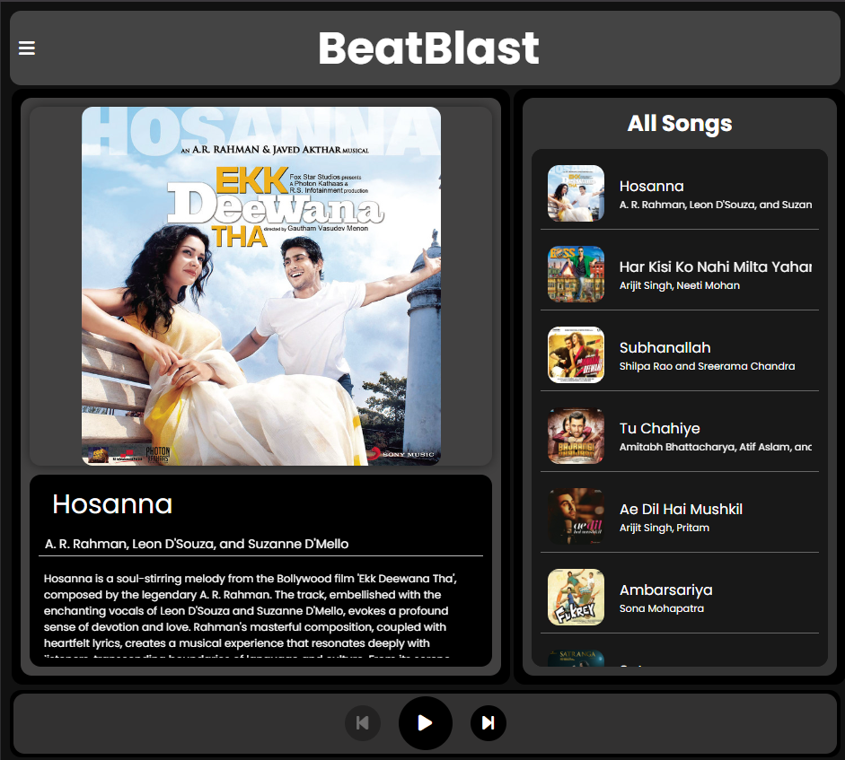

# Music Player Application ♫

This music player, crafted with HTML, CSS, and JavaScript, provides an intuitive interface for users to explore and enjoy their favorite tracks effortlessly. Its seamless navigation and search capabilities empower users to discover new music and create personalized playlists with ease.

## About

BeatBlast: Your go-to music hub for discovering, creating, and enjoying your favorite beats with ease and style.

## Features

- Play, pause, skip to the next or previous song.
- Display song details including name, artist, album, and description.
- Search for songs by name.
- Responsive design for desktop and mobile devices.

## Usage

1. Access the music player application hosted on GitHub Pages [here](https://satendra03.github.io/BeatBlast-MusicHub/).
2. Click on the play button to start playing the currently selected song.
3. Use the next and back buttons to navigate through the playlist.
4. Click on the search button to search for specific songs by name.
5. Enjoy listening to your favorite music!

## Technologies Used

This music player application is built using a combination of the following technologies:

- HTML5: Used for structuring the web pages.
- CSS3: Employed for styling the visual elements and enhancing the user interface.
- JavaScript: Utilized for implementing interactive features and functionality, such as song playback, search functionality, and playlist navigation.
- GitHub Pages: Hosted the application, allowing users to access and use it seamlessly.

## Contributing

Your contributions to this project are highly encouraged and deeply appreciated! We value your insights, ideas, and suggestions for new features or improvements as they are invaluable to us. Whether you've spotted a bug, have a feature request, or want to enhance the existing functionality, your contributions play a vital role in shaping the future of this project.

I welcome you to join us in making this project even better. Together, let's innovate and create something impactful!

## Credits

- This application was created by [Satendra Kumar Parteti](https://www.instagram.com/_satendra_03/).
- I extend my sincere appreciation to all the respective owners and talented vocalists for their invaluable contributions to the songs featured in this application.

## Screenshots

Preview of the landing page in desktop size
 
 

Preview of the landing page in table size
 
 

Preview of the landing page in mobile size
 
 

Preview of the menu page in tablet/mobile size
 
 

Preview of the search section
 
 

Preview of the music section in tablet/mobile size
